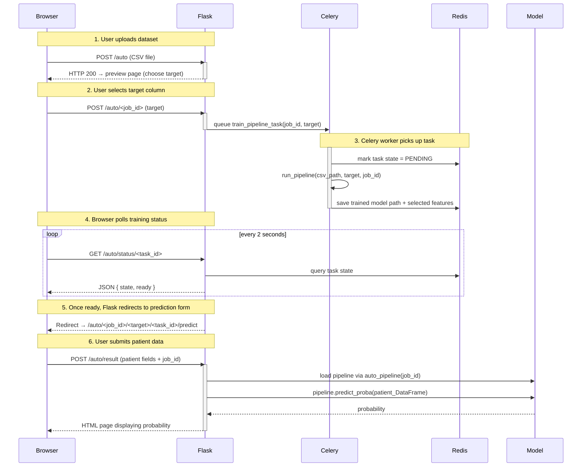
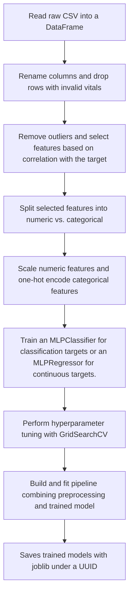

# Model integration with Flask
## Base Blueprint (`/`)
| Method | Path | Description |
|--------|------|-------------|
| `GET`  | `/`  | Landing page – choose **AutoML** or **Custom** mode. |
| `POST` | `/`  | Form action from the buttons above. |

## Custom Blueprint (`/cardio…`)
| Method | Path | Description |
|--------|------|-------------|
| `GET`  | `/cardio` | Static form that feeds the *pre-trained* model. |
| `POST` | `/cardio_predict`| Returns CVD probability. |

## Auto Blueprint (`/auto…`)
| Method | Path | Description |
|--------|------|-------------|
| `GET`  | `/auto` | Upload UI for a CSV dataset. |
| `POST` | `/auto/upload` | Saves CSV under a UUID and redirects to preview. |
| `GET`  | `/auto/<job_id>` | DataFrame preview; pick target column. |
| `POST` | `/auto/<job_id>` | Queues training task and shows loading page. |
| `GET`  | `/auto/status/<task_id>` | JSON `{state, ready}` – polled by JS. |
| `GET`  | `/auto/<job_id>/<target>/<task_id>/predict` | Auto-generated form for the selected features. |
| `POST` | `/auto/result` | Renders probability from the freshly trained model. |
## Request → Prediction Flow

Below is an improved sequence diagram that clearly shows each step from uploading a CSV to receiving a prediction. It groups component interactions and labels each arrow more consistently.


## Summary of the Workflow
1. **Flask (Web Server)**  
   - Receives user requests (e.g., file upload, form submission).  
   - Enqueues long-running tasks in Celery via RabbitMQ.  
   - Polls Redis for task status and retrieves results.  
   - Renders HTML pages and returns responses to the browser.

2. **RabbitMQ (Broker)**  
   - Acts as a FIFO queue for Celery tasks.  
   - Buffers tasks when workers are busy.  
   - Ensures reliable delivery of each training job message to a Celery worker.

3. **Celery (Worker Manager)**  
   - Consumes tasks from RabbitMQ.  
   - Executes Python functions asynchronously (`train_pipeline_task`, etc.).  
   - Pushes results and task state updates into Redis.

4. **Redis (Result Backend)**  
   - Stores each task’s current state (`PENDING`, `STARTED`, `SUCCESS`, `FAILURE`).  
   - Keeps the return value (e.g., model path and selected features) for Flask to fetch.  

## How Redis, RabbitMQ, and Celery Work Together

<details>
<summary>In our Flask + Celery architecture, <strong>RabbitMQ</strong> and <strong>Redis</strong> serve as the messaging backbone and result store, while <strong>Celery</strong> orchestrates background tasks.</summary>

### 1. RabbitMQ (Message Broker)

- **Role:** Acts as a _message queue_ (broker) that enables Flask to hand off tasks to Celery workers asynchronously.
- **What It Does:**
  1. When a user uploads a CSV and selects a target column in the Flask app, we call:
     ```python
     train_pipeline_task.delay(job_id, target)
     ```
     This “.delay(…)” call packages the task arguments (`job_id`, `target`) into a message.
  2. Celery sends that message to the configured RabbitMQ queue (by default, the “celery” queue).
  3. RabbitMQ holds the message until a Celery worker picks it up.
- **Why It Matters:**
  - **Decoupling**: Flask doesn’t perform long-running work (training) on its main thread.
  - **Load Balancing**: Multiple Celery workers can concurrently read from RabbitMQ, allowing us to scale horizontally.

### 2. Celery (Task Queue + Worker Manager)

- **Role:** Consumes messages from RabbitMQ, executes the Python function (e.g., `train_pipeline_task`), and returns results to Redis.
- **What It Does:**
  1. **Worker Startup**  
     - You run:
       ```bash
       celery -A app.celery_app worker --loglevel=info
       ```
     - Celery connects to RabbitMQ (broker) and Redis (result backend).
  2. **Task Consumption**  
     - When RabbitMQ has a pending `train_pipeline_task` message, any idle Celery worker will fetch it.  
     - Celery unpacks the arguments (`job_id`, `target`) and runs the Python code inside `train_pipeline_task`.
  3. **Task Execution (`train_pipeline_task`)**  
     - Loads the CSV from `UPLOAD_FOLDER/<job_id>`.  
     - Calls `run_pipeline(csv_path, target, job_id)`, which:
       - Cleans and preprocesses data.  
       - Selects features.  
       - Trains a scikit-learn pipeline.  
       - Saves `model.pkl` under `app/model/auto_models/<job_id>/`.  
     - Returns a dictionary containing:
       ```python
       {
           "path": "app/model/auto_models/<job_id>/model.pkl",
           "selected_features": [ … ]
       }
       ```
  4. **Result Storage**  
     - Once the function returns, Celery automatically pushes the returned dictionary into Redis under a unique task ID.  
     - Celery also updates the task’s **state** (e.g., PENDING → STARTED → SUCCESS or FAILURE) in Redis.
- **Why It Matters:**  
  - **Non-blocking:** Training can take seconds or minutes. Celery ensures Flask immediately returns control to the user while training happens in the background.  
  - **Retry & Failure Handling:** Celery can be configured to retry failed tasks or mark them as failed, and you can inspect `task.state` at any time.  
  - **Scalability:** By simply starting more Celery worker processes, you can parallelize many training jobs.

### 3. Redis (Result Backend + State Store)

- **Role:** Stores task results and states returned by Celery workers, and also tracks task metadata.
- **What It Does:**
  1. **Task State Tracking**  
     - When Celery enqueues a task, it sets an entry in Redis with `{task_id: "PENDING"}`.  
     - As the worker picks up and runs the task, it updates that entry to `{task_id: "STARTED"}`.  
     - Once the task completes successfully, Celery writes `{task_id: "SUCCESS", result: {…}}`.  
     - If the task fails, Celery writes `{task_id: "FAILURE", traceback: …}`.
  2. **Result Storage**  
     - Whatever data you return from `train_pipeline_task` is saved under a Redis key tied to the `task_id`.  
     - Flask’s `/auto/status/<task_id>` endpoint queries Redis to check `task.state`.  
     - Once `state == "SUCCESS"`, Flask knows it can safely redirect the user to the prediction form.
  3. **Retrieval by Flask**  
     - In `auto_predict`, Flask does:
       ```python
       res = AsyncResult(task_id, app=celery_app)
       result = res.get()  # Pops the {path, selected_features} dict from Redis
       ```
     - Now Flask knows exactly where `model.pkl` lives and which features to render on the form.
- **Why It Matters:**  
  - **Fast Lookups:** Redis is an in-memory data store, so querying task state or fetching the result is very quick.  
  - **Simplicity:** Redis is easy to set up and pairs naturally with Celery for result backends.

</details>

---
# Full scikit-learn pipeline
### **Dataset to use: [cardio_train.csv](../data/cardio_train.csv)**
| Component | Functionality | Impact |
|------|----------------|----------------|
| **Data cleaning** | Filters invalid blood pressure and outliers | Improves model accuracy by removing noise |
| **Feature engineering** | Adds BMI, MAP, and Pulse Pressure | Converts raw vitals into meaningful features |
| **Preprocessing** | Scales with MinMax, encodes with OneHot | Consistent prep during train and predict |
| **AutoML training** | Trains model per upload with selected features | Supports custom models without blocking UI |
| **Model saving** | Saves trained models with joblib under a UUID | Makes experiments repeatable and auditable |

## Full scikit-learn pipeline


